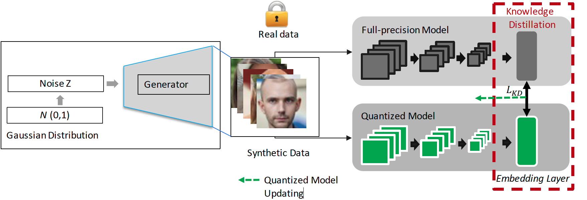

## This is the official repository of the paper:
#### QuantFace: Towards Lightweight Face Recognition by Synthetic Data Low-bit Quantization
Paper on arxiv: [arxiv](https://arxiv.org/abs/2206.10526)

### Accepted ICPR 2022




| Model  | Pretrained model|
| ------------- |------------- |
|   ResNet100   |[pretrained-mode](https://drive.google.com/drive/folders/1JRXGS5cs7xdvRZt5sr2UGheQEzzQ0YLv?usp=sharing) |
|   ResNet100 W8A8 (Real data)   |[pretrained-mode](https://drive.google.com/drive/folders/1JRXGS5cs7xdvRZt5sr2UGheQEzzQ0YLv?usp=sharing) |
|   ResNet100 W8A8 (Synthetic data)   |[pretrained-mode](https://drive.google.com/drive/folders/1JRXGS5cs7xdvRZt5sr2UGheQEzzQ0YLv?usp=sharing) |
|   ResNet100 W6A6 (Real data)   |[pretrained-mode](https://drive.google.com/drive/folders/1JRXGS5cs7xdvRZt5sr2UGheQEzzQ0YLv?usp=sharing) |
|   ResNet100 W6A6 (Synthetic data)   |[pretrained-mode](https://drive.google.com/drive/folders/1JRXGS5cs7xdvRZt5sr2UGheQEzzQ0YLv?usp=sharing) |
|   MobileFaceNet   |[pretrained-mode](https://drive.google.com/drive/folders/1JRXGS5cs7xdvRZt5sr2UGheQEzzQ0YLv?usp=sharing) |
|   MobileFaceNet W8A8 (Real data)   |[pretrained-mode](https://drive.google.com/drive/folders/1JRXGS5cs7xdvRZt5sr2UGheQEzzQ0YLv?usp=sharing) |
|   MobileFaceNet W8A8 (Synthetic data)   |[pretrained-mode](https://drive.google.com/drive/folders/1JRXGS5cs7xdvRZt5sr2UGheQEzzQ0YLv?usp=sharing) |
|   MobileFaceNet W6A6 (Real data)   |[pretrained-mode](https://drive.google.com/drive/folders/1JRXGS5cs7xdvRZt5sr2UGheQEzzQ0YLv?usp=sharing) |
|   MobileFaceNet W6A6 (Synthetic data)   |[pretrained-mode](https://drive.google.com/drive/folders/1JRXGS5cs7xdvRZt5sr2UGheQEzzQ0YLv?usp=sharing) |


If you use any of the code provided in this repository, please cite the following paper:
## Citation
```

@inproceedings{quantface_boutros,
	title        = {QuantFace: Towards Lightweight Face Recognition by Synthetic Data Low-bit Quantization},
	author       = {Fadi Boutros and Naser Damer and Arjan Kuijper},
	year         = 2022,
	booktitle = {26th International Conference on Pattern Recognition, {ICPR} 2022,
               Montreal,Quebec ,August 21-25, 2021},
        publisher = {{IEEE}},
        year      = {2022},
}
```

## License

```
The dataset, the implementation, or trained models, use is restricted to research purpuses. The use of the dataset or the implementation/trained models for product development.
This project is licensed under the terms of the Attribution-NonCommercial-ShareAlike 4.0 
International (CC BY-NC-SA 4.0) license. 
Copyright (c) 2021 Fraunhofer Institute for Computer Graphics Research IGD Darmstadt
```